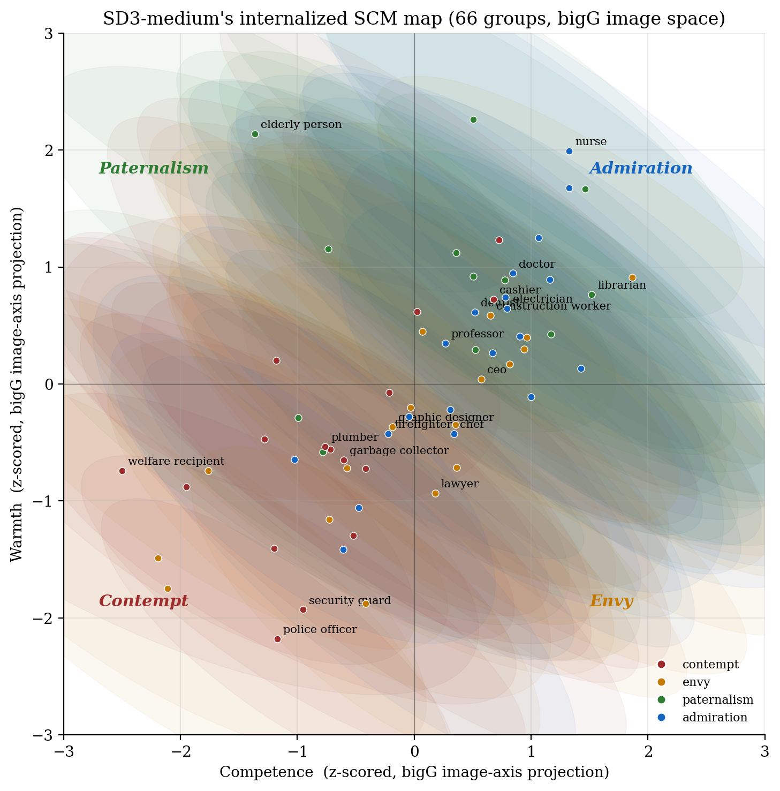

# SCM Probing of SD3-Medium

Does Stable Diffusion 3 Medium internalize the Stereotype Content Model (warmth × competence) when generating portraits of social groups? This repo probes both SD3's text encoders and its image outputs.



## Result

SD3-medium's image outputs partially encode SCM structure, recoverable through OpenCLIP-bigG but not CLIP-L. A Bayesian measurement-error regression gives β_W = 0.48 [0.26, 0.69], β_C = 0.32 [0.10, 0.55]. Per-quadrant KL analysis shows the model reproduces *contempt*-quadrant groups (KL=0.68) faithfully but compresses *envy*-quadrant groups (KL=3.51) — high-status outgroups like CEOs are not placed at their stereotypical low-warmth/high-competence position.

## Dataset

6,600 SD3-medium portraits across 66 social groups (Fiske 2002 identity groups + He 2019 occupations), 5 prompt templates × 20 seeds per group. Available at [Shamima/sd3-medium-scm-corpus](https://huggingface.co/datasets/Shamima/sd3-medium-scm-corpus).

## Pipeline

```
scripts/
├── clean_groundtruth.py          # fix column-shift in Fiske rows, z-score within source
├── embed_images.py               # CLIP-L + DINOv2 image embeddings
├── embed_images_bigG.py         # OpenCLIP bigG image embeddings
├── persist_text_artifacts.py    # bipolar W/C text axes for CLIP-L, bigG, T5-XXL
├── image_side_probe.py          # image-side SCM probe across encoders
├── pgm_analyses.py               # Bayesian regression, per-quadrant KL, residuals
└── make_figures.py               # main figures
```

Run in order. Steps 02–03d require GPU; 04b–06 run on CPU in under a minute.

## Method

**Text-side probe.** For each text encoder, bipolar W/C axes are constructed as `mean(positive-pole adjectives) − mean(negative-pole adjectives)` from a curated SADCAT lexicon. Each group name is embedded, projected onto the axes, and the resulting per-group W/C coordinates are correlated against z-scored human ratings.

**Image-side probe.** Per-group means of the 100 image embeddings are projected onto the same encoder's text-derived bipolar axes. Geometric validity requires the image encoder and text axes to share a vector space — only CLIP-L↔CLIP-L and bigG↔bigG pairs are valid. DINOv2 has no shared text space; it's evaluated by a separate 4-way quadrant classifier on per-group means.

**PGM layer.** A measurement-error Bayesian regression: per-group observed model coord ~ Normal(latent group mean, SEM), human rating ~ Normal(α + β·latent, τ). 4 chains, 1000 tune + 1000 draws in PyMC. Per-quadrant KL fits one 2D Gaussian per quadrant to model coords and to human coords, computes symmetric KL between them.

## Findings (one paragraph each)

**Text encoders carry SCM unevenly.** T5-XXL recovers both warmth (r=0.35) and competence (r=0.51) from group-name embeddings. OpenCLIP-bigG recovers competence (r=0.49) but not warmth (r=0.07). CLIP-L is a weak probe for both. The warmth dimension SD3 expresses in images therefore originates primarily in T5 conditioning.

**bigG image space recovers SCM; CLIP-L does not.** Image-side probe with bigG yields r_W=0.48, r_C=0.34, both significant after a 2000-fold permutation test. CLIP-L gives r_W=0.01, r_C=0.05. DINOv2 4-way quadrant accuracy is 44% (chance 25%, majority baseline 30%), corroborating that structure exists in pixels independent of CLIP alignment.

**SD3 compresses the envy quadrant.** High-status outgroups (CEO, lawyer, financial advisor) sit near the origin in SD3's bigG image space rather than at their stereotypical low-W/high-C position. Residual analysis confirms these as the worst-fit groups after Procrustes alignment.

## Reproducing

```bash
pip install -r requirements.txt
python scripts/clean_groundtruth.py
python scripts/embed_images.py  --hf_dataset Shamima/sd3-medium-scm-corpus
python scripts/embed_images_bigG.py --hf_dataset Shamima/sd3-medium-scm-corpus
python scripts/persist_text_artifacts.py --include_t5
python scripts/image_side_probe.py
python scripts/pgm_analyses.py
python scripts/make_figures.py
```

T5-XXL is loaded from Stability AI's fp8 release (~5GB download, ~20GB GPU at runtime).

## Limitations

- Text-axes are derived from a fixed lexicon; results may shift with different adjective sets.
- Image-side bigG probe shares its visual encoder with one of SD3's text encoders, raising mild circularity concerns. The DINOv2 axis-free probe partially addresses this.
- 100 samples per group with 5 prompt templates; broader prompt variation would strengthen claims about visual stereotype intensity.
- Ground truth combines Fiske 2002 (1–5 scale) and He 2019 (centered z-scores); z-scoring within source is a defensible but imperfect alignment.

## Citation

Data: Fiske et al. (2002), Cuddy et al. (2007), He et al. (2019). Probing methodology: Nicolas, Bai & Fiske (2021) SADCAT lexicon.